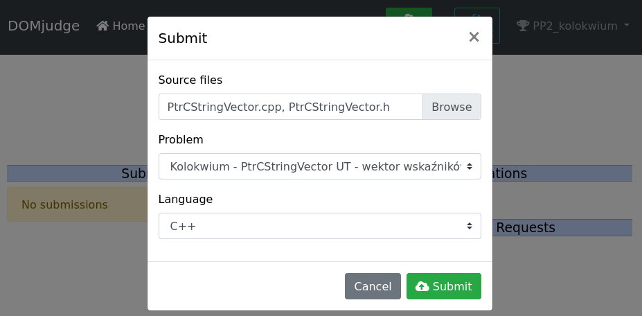

# Kolokwium z Podstaw Programowania 2 dnia 7 VI 2021

## Zasady ogólne:

1. Zanim cokolwiek Państwo zrobią proszę o uzupełnienie swoich danych w pliku: `main.cpp`, dane te to:
   - `FIRSTNAME`
   - `SURNAME`
   - `MAIL`
   - `BOOK_ID` (nr albumu)
2. Kolokwium nie da się nie zdać - jest traktowane jako punkty, które się sumują do reszty, nie będzie poprawki grupowej!
3. W trakcie kolokwium należy mieć włączoną kamerkę i nie mieć słuchawek, kto będzie bez kamery to o 1/3 punktów mniej.
4. Wysłana paczka ma się bezwzględnie kompilować na systemie Linux.
   - Jak ktoś nie ma linuxa może użyć narzędzia: http://administrare.kis.agh.edu.pl:12345 (konieczny VPN AGH) i na nim zarejestrować się, ale jako nick powinien być **numer albumu**, aczkolwiek proszę też uzupełnić pozostałe dane (imię, nazwisko, mail).
   - Aby wysłać zadanie należy wybrać konkurs (_kolokwium pp2_), problem (_kolokwium_), oraz jezyk programowania (_C++_), proszę załączyć obydwa pliki `PtrCStringVector.h`, `PtrCStringVector.cpp`, jak na obrazku: 
5. Kolokwium z założenia będzie sprawdzane automatycznie, przez testy jednostkowe dostępne w pliku: `PtrCStringVectorTests.cpp`, dlatego poza kompilowaniem proszę aby nie crashowało na żadnym teście, jeśli tak się dzieje to brane pod uwage jest tylko tyle testów ile ich przechodzi do momentu crasha.
6. Mam program antyplagiatowy, dlatego proszę pracować samodzielnie! Osoby które udostępniają swoje rozwiązania również będą miały karę!
7. Dobrze jakby nie było warningów kompilacji (flagi: `-Wall -Wextra -pedantic -Werror`, a dla hardcorów jeszcze:  `-Weffc++`)
8. Punkty będą odejmowane za wycieki pamieci (jest podpiety `valgrind`)
9. Zakres materiału: wykłady [1, 10]
10. Niewykluczone jest sprawdzanie ręczne - zależnie od prowadzącego daną grupę. Dlatego proszę wykorzystać zapas czasu aby doprowadzić kod do porządku nie tylko do działania.

---

Szczegółową treść kolokwium znajdą Państwo w opisie metod klasy: `PtrCStringVector`